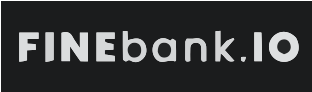

<p align="center"></p>

# FinanceApp

A comprehensive personal finance management application built with Laravel, Inertia.js, and Vue.js. This application helps you track your income, expenses, bills, and savings goals in one unified dashboard.

## 🚀 Features

### 📊 Dashboard
- **Total Balance**: Real-time overview of your current financial standing.
- **Bank Cards**: Visual representation of your accounts.
- **Goals Overview**: Quick look at your savings targets vs. current progress.
- **Upcoming Bills**: Alerts for bills due soon.
- **Recent Activity**: Scrollable list of the latest 10 transactions.
- **Weekly Statistics**: Comparison of this week's spending vs. last week.
- **Expenses Breakdown**: Monthly comparison of expenses.

### 💸 Transactions
- **Comprehensive Logging**: Record income and expenses with categories.
- **Monthly Grouping**: Transactions are automatically grouped by month for easy review.
- **Pagination**: Efficient handling of large transaction histories.
- **Filtering**: Filter transactions by year and month.
- **Search & Edit**: Easily find and modify past transactions.

### 🧾 Bill Management
- **Recurring Bills**: Track monthly or periodic bills.
- **Pay Feature**: One-click "Pay" button that:
  - Marks the bill as paid.
  - Automatically creates a corresponding expense transaction.
- **Status Tracking**: Visual indicators for Paid/Unpaid/Overdue bills.

### 🎯 Savings Goals
- **Goal Tracking**: Set target amounts and deadlines for your financial goals.
- **Deposit Feature**: "Deposit" funds directly into a goal, which:
  - Updates the goal's current amount.
  - Automatically creates a transaction record for the deposit.
- **Progress Bars**: Visual progress indicators for each goal.

### 📈 Analytics
- **Visual Charts**: Interactive charts powered by Chart.js.
- **Expense Breakdown**: Categorized view of where your money is going.
- **Monthly Reports**: Filter data by specific months and years.

## 🛠 Tech Stack

- **Backend**: Laravel 11 (PHP)
- **Frontend**: Vue.js 3, Inertia.js
- **Styling**: Tailwind CSS (with Dark Mode support)
- **Database**: MySQL / SQLite
- **Icons**: Heroicons
- **Charts**: Chart.js

## ⚙️ Installation

1. **Clone the repository**
   ```bash
   git clone https://github.com/yourusername/financial-app.git
   cd financial-app
   ```

2. **Install PHP dependencies**
   ```bash
   composer install
   ```

3. **Install Node.js dependencies**
   ```bash
   npm install
   ```

4. **Environment Setup**
   ```bash
   cp .env.example .env
   php artisan key:generate
   ```
   *Configure your database settings in the `.env` file.*

5. **Run Migrations**
   ```bash
   php artisan migrate
   ```

6. **Build Assets**
   ```bash
   npm run build
   ```

7. **Serve the Application**
   ```bash
   php artisan serve
   ```
   Access the app at `http://localhost:8000`.


## 🔐 Default Credentials (Seeder)

If you ran the seeder, you can log in with:
- **Email**: `admin@example.com`
- **Password**: `password`

## 🤝 Contributing

Contributions are welcome! Please feel free to submit a Pull Request.

## 📸 Screenshots


## 📄 License

This project is open-sourced software licensed under the [MIT license](https://opensource.org/licenses/MIT).
